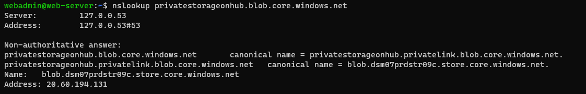
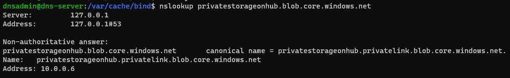
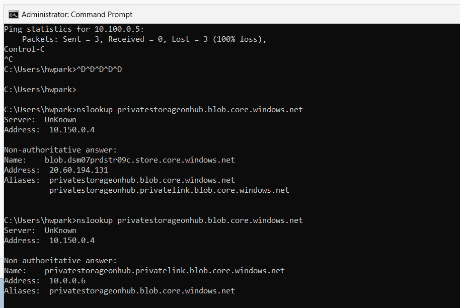

### Step 4. Private DNS Resolver 생성 및 Forwarder 설정
URL : [Step4_PrivateDNSResolver](./step04_PrivateDNSResolver.md)
- 4.1 생성 (VNet 선택, Inbound EP, Outbound EP, 규칙 설정)
- 4.2 DNS 서버(Step1에서 구축한) forwarder Inbound Endpoint 주소대역으로 설정
- 4.3 Step3.2에서 확인하였던 DNS 조회 재확인


1. Private DNS Resolver 생성

- 사진4-1 기본 설정 값 (VNet선택, 이름 설정)
- 사진4-2 Inbound Endpoint 설정
- 사진4-3 Ruleset 추가(도메인이름, 도메인서버 IP 주소)
- 사진4-4 Outbound Endpoint 설정


2 DNS 서버(Step1에서 구축한) forwarder Inbound Endpoint 주소대역으로 설정
- 2.1 Inbound Endpoint 확인(사진4-5) : 
- 2.2 dns forwarder 설정 (/etc/bind/named.conf.options)
    - ```bash
        arduinoCopy code
        options {
            // 기타 옵션들...
            forwarders {
                AZURE_PRIVATE_DNS_RESOLVER_IP;
            };
        };
        ```

사진4-6

- 2.3 bind 재시작
```bash
dnsadmin@dns-server:/var/cache/bind$ sudo systemctl restart bind9
dnsadmin@dns-server:/var/cache/bind$ sudo systemctl restart named
```

3. DNS 조회 확인


2. VM에서 Private Endpoint 조회 결과 nslookup privatestorageonhub.blob.core.windows.net

2-1. Hub-VNet의 VM에서 Private Endpoint 조회 결과 
- 사진 3-3 
  
- 사진 3-4 (dns서버 별도 설정 X) : 조회 됨
2-2. Spoke-VNet의 VM에서 Private Endpoint 조회 결과 
- Hub Spoke 네트워크 통신 설정을 못해 확인 못하였으나, 예상 결과 : 조회 안 됨
- 통신 설정 후 추가 확인 (조회 됨, VNet간 peering 되어 있으면 dns 조회되나 private IP)
  
2-3. Onprem-VNet의 VM에서 Private Endpoint 조회 결과 -> 조회 안됨
- 사진 3-5 (DNS 서버)
  
- 사진 3-6 win-client-vm
  


dns서버 10.150.0.4 설정하면 hub vnet에서 조회 안되는지 확인이 필요
통신 설정 후 추가 확인 (조회 됨, VNet간 peering 되어 있으면 dns 조회되나 private IP)