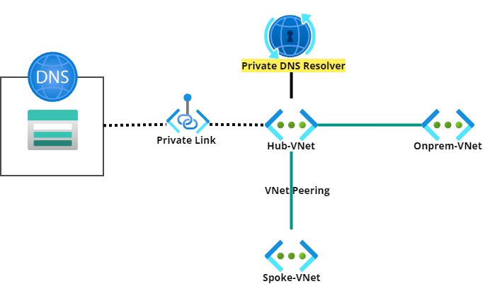

## Private DNS Resolver TEST
### 테스트 Architecture

### 사전 준비
- VNet 3개
    - Central US : Hub-VNet, Spoke-VNet
    - East US : Onprem-VNet
- VM 생성
    - dns-server(Onprem-VNet)
    - mgmt-vm(Hub-VNet) 
    - win-mgmt-vm(Hub-VNet) : 추후 라우팅 경로 작업 진행 필요
    - web-server(Spoke-VNet)
    - win-client-vm(Onprem-VNet)
  
### Step 1. DNS 서버 구축 (Onprem-VNet)
- Windows 서버
- Linux 서버 (CentOS)
- Linux 서버 (Ubuntu)
  - URL : [Step1_Ubuntu링크](./step01_BuildingDNS_ubuntu.md)

### Step 2. (Hub-VNet, Spoke-VNet, Onprem-VNet) 모든 서버 DNS 설정 변경
URL : [Step2_DNS 서버 설정](./step02_DNSSetting.md)
- 2.1 DNS 설정 방법
  - Azure단(VNet)에서 설정
  - Azure단(NIC)에서 설정
  - OS(Windows)단에서 설정
  - OS(Linux)단에서 설정
- 2.2 모든 서버 (Hub-VNet, Spoke-VNet, Onprem-VNet) Step1에서 구축한 private DNS 서버로 DNS 서버 설정 
  
### Step 3. Private Endpoint 생성(Hub-VNet)
URL : [Step3_PrivateDNS생성](./step03_PrivateDNS.md)
- 3.1 Storage 계정 생성 후 Blob Storage에 대한 Private Endpoint 생성 및 Hub-VNet과 Private Link 연결
- 3.2 Hub-VNet, Spoke-VNet, Onprem-VNet Private Endpoint에 대한 DNS 조회 확인

### Step 4. Private DNS Resolver 생성 및 Forwarder 설정
URL : [Step4_PrivateDNSResolver](./step04_PrivateDNSResolver.md)
- 4.1 생성 (VNet 선택, Inbound EP, Outbound EP, 규칙 설정)
- 4.2 DNS 서버(Step1에서 구축한) forwarder Inbound Endpoint 주소대역으로 설정
- 4.3 Step3.2에서 확인하였던 DNS 조회 재확인