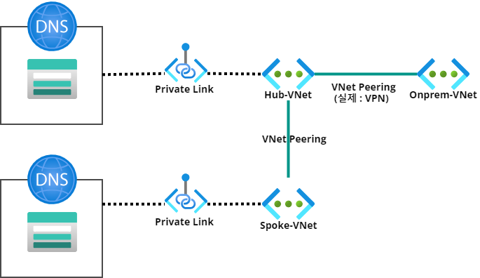

## 기존 아키텍처

## 현재 
```plaintext
현재 상황 : 사설 통신, 사설 DNS 서버 사용, Azure Private 서비스 증가

온프렘-Azure간 Peering(VPN) 연결 된 상태에서 DNS서버에서 Azure에서 생성하는 Private Endpoint(Private Link)로 연결된 리소스에 대해 DNS Query를 자동으로 관리하고 싶다.  
(해당 서비스들에 필요한 DNS 정보를 온-프레미스 DNS에 등록 중 -> 새로 생성하는 Private endpoint 및 Link를 자동으로 포워딩)

현재 상황 예상되는 문제 : 
Private Link를 이용하는 서비스 종류가 많아짐에 따라 온-프레미스 DNS에서 관리하는 것이 비 효율적, 휴먼 에러의 발생 가능성이 높아질 수 있음. 

```
## 구현 시나리오
```plaintext
1. Private DNS Resolver 생성
- inbound endpoint(서브넷1), outbound endpoint(서브넷2), 규칙설정
2. Private DNS 서버 Forwarder 설정
- inbound endpoint에 대하여 Forwarder 설정
- 경로 :
3. 설정 전후 DNS 쿼리 조회 확인
- private FQDN으로 nslookup 명령어 조회시 IP 조회 여부 확인
```
- 예상 아키텍처
1차 목표 : Hub-VNet에 연결된 Private Link에 대한 DNS 쿼리 포워딩 작업, Private DNS Resolver에 리소스 확인을 위함. 


### 문제 상황 
: Hub와 Spoke VNet에 Private Link가 각각 있는 상황에서 한 번에 조회하도록 설정할 수 있나?
- 이 경우 Private DNS Resolver를 각각 생성하고 DNS 서버에 forwarder 설정을 두 개의 inbound endpoint로 설정하면 되나?

### 의문점
- Private Link를 Hub, Spoke VNet을 각각 연결해야만 하나?
- Hub와 Spoke VNet이 이미 Peering되어 있고, Hub VNet으로 Private Endpoint 생성 및 Private Link를 연결하면 안 되나?